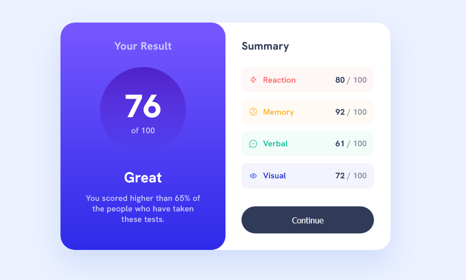

# Frontend Mentor - Results Summary Component solution

This is a solution to the [Results Summary Component challenge on Frontend Mentor](https://www.frontendmentor.io/challenges/results-summary-component-CE_K6s0maV). Frontend Mentor challenges help you improve your coding skills by building realistic projects. 

## Table of contents

- [Overview](#overview)
  - [The challenge](#the-challenge)
  - [Screenshot](#screenshot)
  - [Links](#links)
- [My process](#my-process)
  - [Built with](#built-with)
  - [What I learned](#what-i-learned)
- [Author](#author)

## Overview

### The challenge

Users should be able to:
- View the optimal layout for the interface depending on their device's screen size (Full-screen mobile layout to a centered, rounded card on desktop).
- See hover and focus states for all interactive elements on the page.
- **Bonus:** Dynamically load the category scores and icons using the provided JSON data via JavaScript.

### Screenshot



### Links

- [Solution URL](https://github.com/Kking927/results-summary-component)
- [Live Site URL](https://kking927.github.io/results-summary-component/)

## My process

### Built with

- Semantic HTML5 markup
- CSS custom properties
- Flexbox for layout
- Fluid typography and spacing using CSS `clamp()`
- Vanilla JavaScript (Fetch API & DOM Manipulation)
- Mobile-first workflow

### What I learned

Building this component was a great exercise in fine-tuning visual details and managing data flow. Key takeaways include:

1. **Color Transparency with `hsla`**: Adjusting the alpha channel in `hsla` color values to create lighter, translucent background tints for the summary list items that match the target design.
    ```css
    /* Primary */
    --light-red: hsl(0, 100%, 67%);
    --orangey-yellow: hsl(39, 100%, 56%);
    --green-teal: hsl(166, 100%, 37%);
    --cobalt-blue: hsl(234, 85%, 45%);
  
    /* Primary Background Tints (using transparency) */
    --light-red-bg: hsla(0, 100%, 67%, 0.05);
    --orangey-yellow-bg: hsla(39, 100%, 56%, 0.05);
    --green-teal-bg: hsla(166, 100%, 37%, 0.05);
    --cobalt-blue-bg: hsla(234, 85%, 45%, 0.05);
    ```
2. **Dynamic Data Injection**: Utilizing JavaScript's `fetch()` API to asynchronously load `data.json` and render the list items into the DOM instead of relying on hardcoded HTML.

## Author

- Frontend Mentor - [@Kking927](https://www.frontendmentor.io/profile/Kking927)
- GitHub - [Kking927](https://github.com/Kking927)
